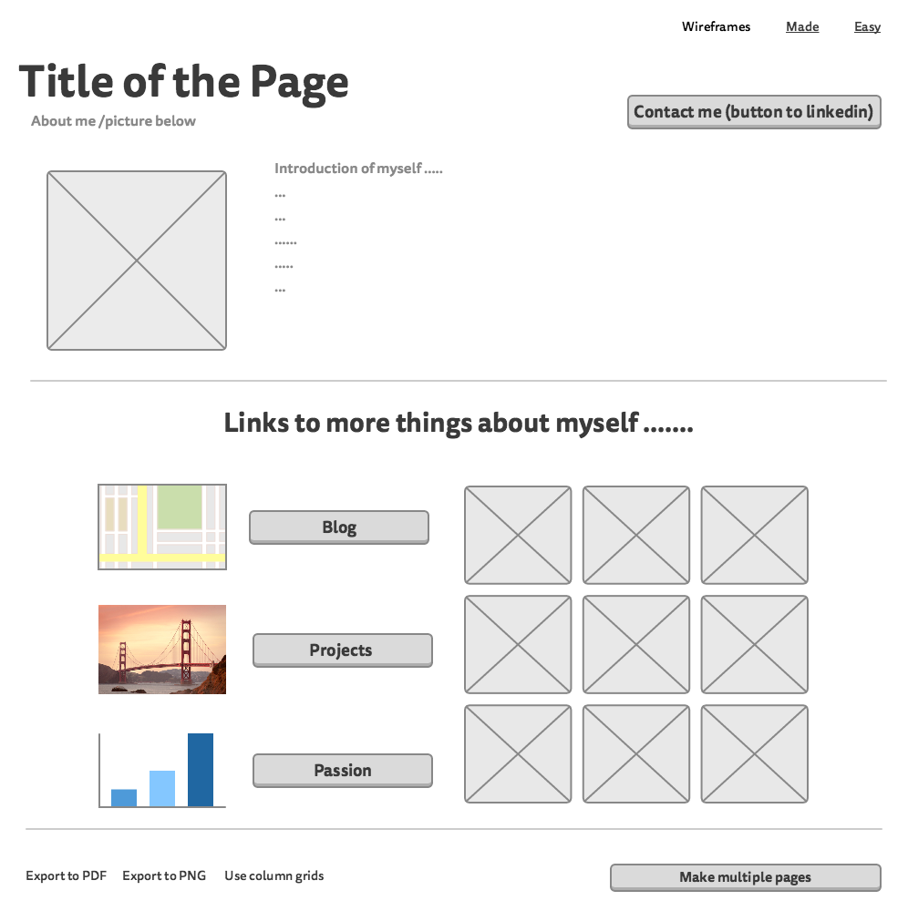

1. What is a wireframe?
  A wireframe is an important step in any screen design process; it makes it easier for you to plan the layout according to how you want your user to process the information. Is a visual guide or sketch that shows you're the framework of how the website will be like.

2. What are the benefits of wireframing?
  The benefits of wireframming is that it gives you a plan/layout so you can sketch out how your website will look. This way you can be more organizing when designing and building out your website. It also makes building out sites more easily and design friendly. Also it helps you plan out what you will be doing so when you code it in it is more organized.

3. Did you enjoy wireframing your site?
  I did enjoy wireframing. I thought it was pretty fun but I think I would like it more if I were able to put more details, more of a rough draft than sketch.

4. Did you revise your wireframe or stick with your first idea?
  I played around with the couple of ideas. But I stuck to the main concept of how I wanted it to look like.

5. What questions did you ask during this challenge? What resources did you find to help you answer them?
  Some questions I had were just about wireframing but I used the reading that we were provided. I also just searched some wireframe layouts for some inspiration. I used Mockingbird to make my wireframes as well.

6. Which parts of the challenge did you enjoy and which parts did you find tedious?
  Most tedious part of this challenge is getting the picture onto my subl with markdown. I was stuck on this from the pervious challenge but moved on to see what else I can do till I got that answer.
