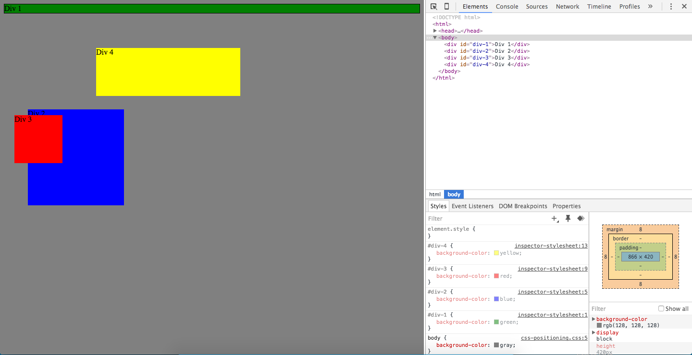
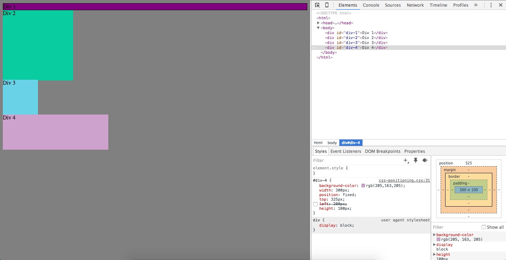
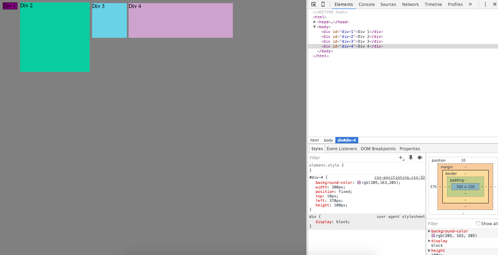
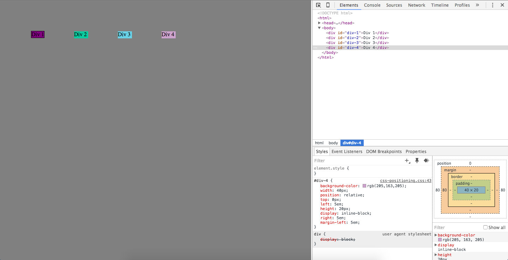
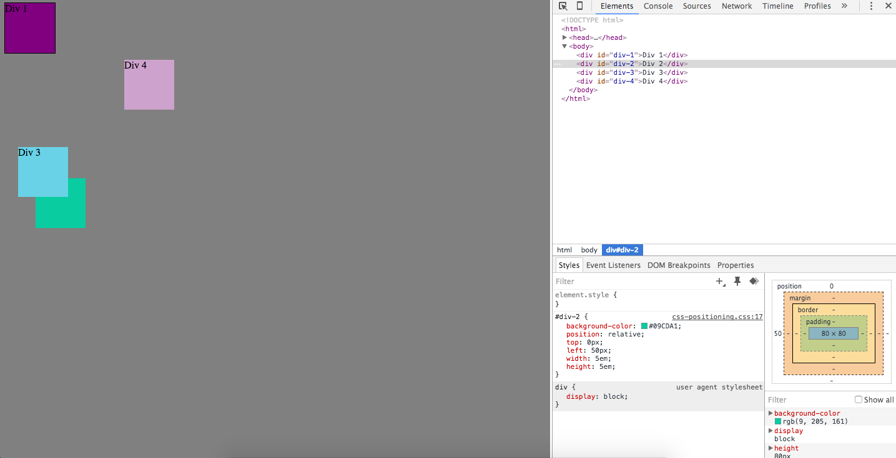
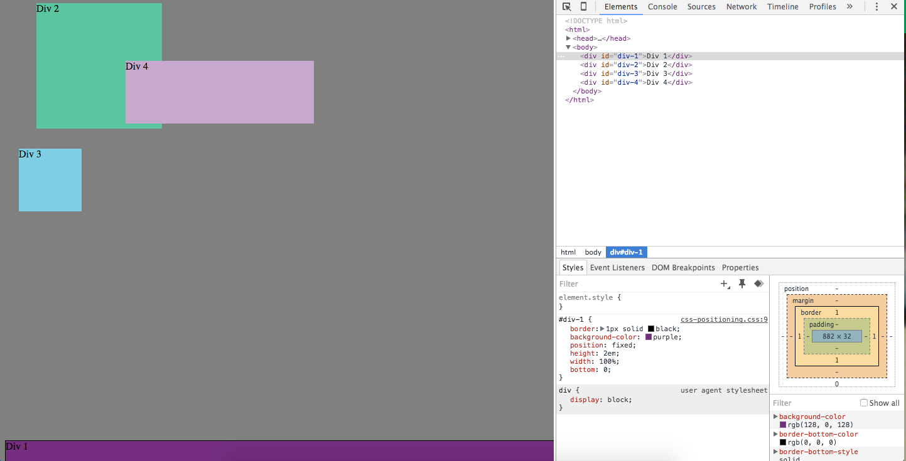
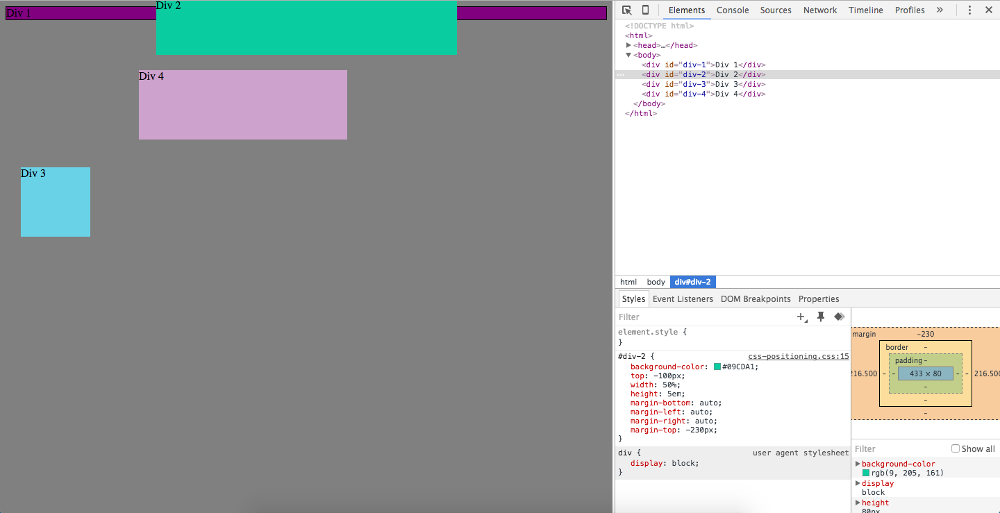
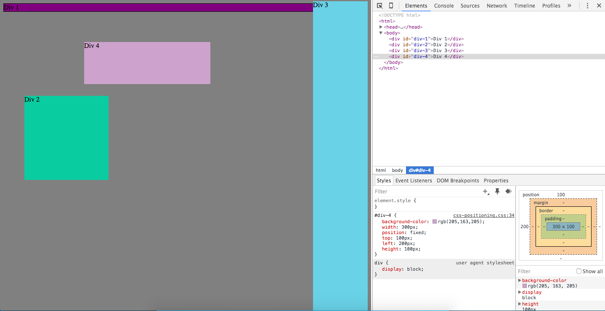
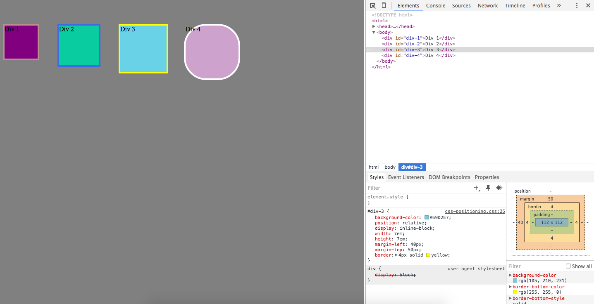

How can you use Chrome's DevTools inspector to help you format or position elements?
  You can use Chrome's DevTools to inspect the specific part of the website and then you can create your own or edit it on the Chrome site to see how it changes.

How can you resize elements on the DOM using CSS?
  You can resize elements by changing the width and height.

What are the differences between absolute, fixed, static, and relative positioning? Which did you find easiest to use? Which was most difficult?
  All these changes the position of the picture on the page and where the objects are position. I found the easiest ones to use were fixed and realtive. I personally like relative the most because it changes the objects relative to the rest of the page.

What are the differences between margin, border, and padding?
  Border makes a border around your object, kind of like an outline. Margin spaces between the the objects, and padding gives the object more room.

What was your impression of this challenge overall? (love, hate, and why?)
  This challenge wasn't too bad. It gave me a better idea on how to trial and error shapes and sizes using Chrome DevTools and gave me a better understanding how to reshape objects using CSS.
