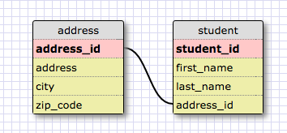
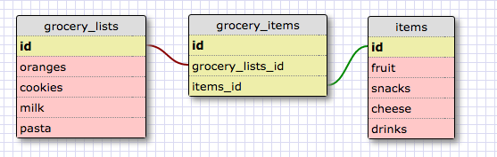

<h1>Release 2: Create a One-to-one Schema</h1>

<h1>Release 4: Refactor</h1>

<h1>Reflection</h1>

<h3>What is a one-to-one database?</h3>
A one to one data base is a pair, basically when two things have a single relationship to one another.

<h3>When would you use a one-to-one database? (Think generally, not in terms of the example you created).</h3>
You would use a one-to-one database when you have relationships where a group of fields can all optionally be empty.

<h3>What is a many-to-many database?</h3>
A many-to-many relationship is a relationship between tables in a database when a parent row in one table contains serveral child row in other tables.

<h3>When would you use a many-to-many database? (Think generally, not in terms of the example you created).</h3>
You can use a many-to-many database very often when you are generally connecting one thing that has many other child in different tables.

<h3>What is confusing about database schemas? What makes sense?</h3>
I think what is confusing about this is coming up with my own examples to use in the table. It's hard for me to think of things that can link to one another. I think it would be easier when I'm actually making something where I have to do a relationship table.

